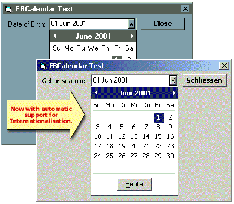



## EBCalendar

### Description

A simple date entry control with drop down calendar - now with automatic support for internationalisation
 
### More Info
 

             |
---                |---
**Submitted On**   |2001-06-04 09:22:04
**By**             |[Richard@Home](https://github.com/Planet-Source-Code/PSCIndex/blob/master/ByAuthor/richard-home.md)
**Level**          |Intermediate
**User Rating**    |4.4 (22 globes from 5 users)
**Compatibility**  |VB 6\.0
**Category**       |[Custom Controls/ Forms/  Menus](https://github.com/Planet-Source-Code/PSCIndex/blob/master/ByCategory/custom-controls-forms-menus__1-4.md)
**World**          |[Visual Basic](https://github.com/Planet-Source-Code/PSCIndex/blob/master/ByWorld/visual-basic.md)
**Archive File**   |[EBCalendar20541642001\.zip](https://github.com/Planet-Source-Code/richard-home-ebcalendar__1-23666/archive/master.zip)

